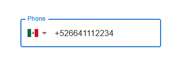

# Mui Phone Input

Mui based input component for phone number with country code and flag.

## Installation

```shell-script
npm install os-mui-phone-input
```

## Usage

The phone input is based on Mui **TextField** component and inherits all its props. you can check the official [documentation](https://mui.com/material-ui/react-text-field/#form-props) for more detailed info.

### basic usage of Phone Input:

```tsx
import OsMuiPhoneInput from 'os-mui-phone-input'

<OsMuiPhoneInput label="Phone" variant="outlined"/>
```

